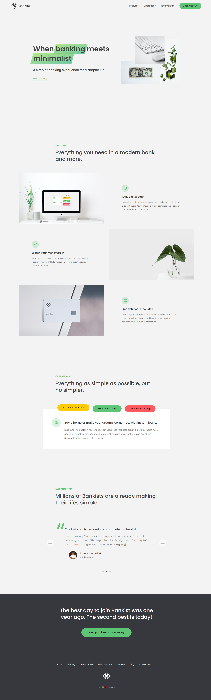

# <a href="https://bankaa.netlify.app" target="_blank">Bank website</a>
Single page website Bank website built using Vanilla JavaScript, HTML &amp; CSS. It uses webpack as module bundler and NPM as package manager.

   

### preview

